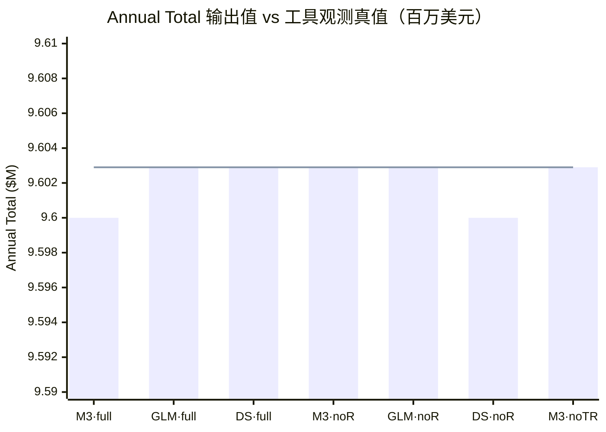

# Task 0｜Agent 基础与环境准备

**窗口**：09-14 → 09-17 03:00
**对应章节**：第 1 章 AI Agent 入门（**PDF p.15–37** ／ 印刷 p.7–29）

## 一、Task 概述

> 🟦 本节由 agent 撰写（2026-09-15 用户确认归属）。

### 1. 基本信息

| 项 | 内容 | 来源 |
|---|---|---|
| 任务编号 / 名称 | Task 0 ｜ Agent 基础与环境准备 | 共学计划 |
| 截止时间 | **2026-09-17 03:00**（硬截止，逾期报离群） | 开营公告（2026-09-16，与共学计划一致） |
| 对应教材 | 第 1 章 AI Agent 入门（**PDF p.15–37** ／ 印刷 p.7–29） | 教材目录实测 |
| 配套实验 | 仓库 `chapter1/`，5 个：1-1 `context`、1-2 `web-search-agent`、1-3 `search-codegen`、1-4 `image-gen-workflow`、7-1/7-2 `learning-from-experience` | 仓库实测 |

### 2. 任务解读

Task 0 要同时站住两条腿：

1. **环境**——搭好一套能跑通教材实验的环境。这是后面 6 个 Task 的地基：**一次做对，省 18 天的事**；做错了，每章都要重踩一遍。
2. **基础**——读懂第 1 章，建立全书的坐标系：**Agent = LLM + 上下文 + 工具**，以及贯穿全书的五个设计模式和三层护栏。后面九章都是这两样东西的展开。

### 3. 验收标准

- [ ] 环境可用：`.venv` 就绪，能跑出**真实 API 结果**（不是 mock）
- [ ] 实验 1-1 五臂消融跑通，能读出各臂差异，并解释差异从何而来
- [ ] 能用自己的话说清：**为什么模型越强，Harness 工程反而越重要**
- [ ] 第 1 章 10 道思考题完成作答

## 二、实验过程

> 🟦 本节由 agent 撰写，用户按此操作。

### 2.1 环境搭建（已完成并验证 · 2026-09-14 ~ 09-15）

**目的**：让 `chapter1/context` 实验能跑起来。

**代码来源**：`https://github.com/bojieli/ai-agent-book` → 稀疏检出到 `D:\agent study\ai-agent-book`

```powershell
# ① 装 uv（走清华镜像）
python -m pip install -U uv -i https://pypi.tuna.tsinghua.edu.cn/simple

# ② 稀疏克隆——只取实验代码，不拉 15 种语言的整本书
git clone --depth 1 --filter=blob:none --sparse https://github.com/bojieli/ai-agent-book.git "D:\agent study\ai-agent-book"
git -C "D:\agent study\ai-agent-book" sparse-checkout set chapter1 agentbook tests   # 09-15 晚已扩充为全部章节 chapter1..chapter10（直连断，走 gh-proxy.com 镜像完成）

# ③ 建环境（锁定 uv 自带的 3.12.14，走清华源）
$env:UV_DEFAULT_INDEX = 'https://pypi.tuna.tsinghua.edu.cn/simple'
uv sync --locked --extra ch1 --python 3.12

# ④ 配密钥：全局母本 D:\agent study\.env；各实验目录另有本地 .env（本地优先于全局）
```

**验证结果**：`.venv` = **Python 3.12.14 + 60 个包**；`Config.print_config()` 输出 `Provider: deepseek` —— 证明 `.env` 被正确读取（默认值是 `doubao`，读到才会变）。

### 2.2 实验 1-1 运行步骤（**由你执行**）

> 🟦 步骤由 agent 撰写；**运行由用户亲自完成**（2026-09-15 用户确认）。

| 顺序 | 脚本完整路径 | 参数（填 Parameters 框） | 期望输出 | 注意事项 |
|---|---|---|---|---|
| ① ⭐ | `D:\agent study\ai-agent-book\chapter1\context\run_experiment_1_1.py` | M3：`--provider minimax`／GLM：`--provider zhipu --model glm-5.3-flash`／DeepSeek：`--provider deepseek` | 屏幕打 analysis JSON；落盘 `validation\real_<时间戳>\evidence.json` + `.sha256`；通过则尾部 `Promoted to validation/latest.json` | **实验本体（作者正式运行器）**。Working directory = `...\context`；实验目录 `.env` 优先于全局，**必须显式 `--provider`**（未设 `LLM_PROVIDER`，防跑串）；**不手写 `--modes`**——省略即五组全跑＝规范配置；两组会撞 5 轮上限，别中途掐断；非 0 退出码＝未过验收（如基线错误），是设计不是坏；💰 最大 |
| ② 可选 | 同上 `run_experiment_1_1.py` | 开关 A：`--provider minimax --modes no_tool_calls --task unguarded`／开关 B：`--provider minimax --modes no_tool_results --hidden-result marker` | 各落 `validation\real_<时间戳>\`；尾部 `Not promoted to validation/latest.json` | 作者留的反事实开关；非规范配置、不动 `latest.json`；💰 中 |
| ③ | `D:\agent study\ai-agent-book\chapter1\context\tests\`（目录） | 右键 `tests` → Run "pytest in tests" | 全部 passed（基线 24 passed） | 离线回归；🆓 |
| ④ | （无脚本）读 `validation\latest.json` | — | `arm_outcomes`／`manuscript_behavior_claims`／`usage` | `latest.json` 只存最后一次规范运行；三模型对比看各自 `real_<时间戳>` 目录；🆓 |

**五个实验组**（定义出自作者 README；省略 `--modes` 即五组全跑）：

| 组（mode） | 拿走什么 | 预期行为（作者注） |
|---|---|---|
| `full` | 不拿——完整轨迹，**基线** | 正常完成 |
| `no_history` | 历史消息：只发系统提示＋当前任务，不留任何 ReAct 步骤 | 遗忘此前所有步骤，易**重复调用工具**直至触顶 |
| `no_reasoning` | 写回轨迹前，从每条 assistant 消息剥离 `reasoning_content`（思考过程） | 缺少战略规划 |
| `no_tool_calls` | 请求中**省略 `tools` 参数**——模型没有工具定义可调（作者基准表显示名即 "no tool definitions"） | 无法与外部世界交互，但回答可能**看似完整**：拒绝，或用记忆里的汇率作答 |
| `no_tool_results` | 每个工具结果内容**置空**（消息仍在、不携带观测） | 没有反馈地行动且**察觉不到**，反复重调直至触顶 |

### 2.3 实验 1-2 ｜ web-search-agent（**由你执行**——DeepSeek 等效路径；Kimi 原生验收需 Moonshot key）

| 顺序 | 脚本完整路径 | 参数 | 期望输出 | 注意事项 |
|---|---|---|---|---|
| ① ⭐ | `D:\agent study\ai-agent-book\chapter1\web-search-agent\main.py` | `--provider deepseek "<你的问题>"` | 屏幕逐步打印 ReAct 轨迹（思考→`web_search`→观察→答案）；加 `--output result.json` 落问题/轨迹/答案/真实 API 留证 | LLM=DeepSeek（探针实测连通、`max_tokens=32768` 接受）；本地 `web_search`＝作者预留的 `search_impl` 扩展点，首选**百炼托管 web_search 插件**（qwen-turbo 检索＋摘要，与 Kimi 托管搜索架构对等），Bing HTML/RSS 兜底；首跑触顶（Bing 通道垃圾结果，后端已重构），**重跑 3 轮 13 搜索出终答（2026-09-17 00:00）**；💰 DeepSeek 按 token ＋ 百炼搜索按次小额 |
| ② 🆓 | 同上 `main.py` | `--provider offline-demo` | 离线示例轨迹（看 ReAct 形态） | 不调任何服务 |
| ③（暂缓） | `D:\agent study\ai-agent-book\chapter1\web-search-agent\run_experiment_1_2.py` | —（等 [Moonshot key](https://platform.moonshot.cn/)） | — | **规范路径＝Kimi 原生 Formula 实验**（验收要求 `kimi-k3` + `api.moonshot.cn`），无 key 跑不了；①的 DeepSeek 路径按**等效路径**记录，两者结论分开写，不冒充 |

### 2.4 实验 1-3 ｜ search-codegen（联网搜索＋代码解释器，**由你执行**）

> **通用启动前缀**（每行命令都以它开头，后面接脚本路径＋参数）：
> `C:\Python314\Scripts\uv.exe run "D:/agent study/.venv/Scripts/python.exe" "<脚本完整路径>"`
> ⚠️ 两个脚本旗标**差一个字母**：runner 用复数 `--backends`，main.py 用单数 `--backend`——别混（2026-09-17 实踩：main.py 不认 `--backends`）。

| 顺序 | 脚本完整路径 | 参数 | 期望输出 | 注意事项 |
|---|---|---|---|---|
| ① ⭐ | `D:\agent study\ai-agent-book\chapter1\search-codegen\run_experiment_1_3.py` | `--backends dashscope`（默认 openai＋dashscope，**必须显式只传 dashscope**；`--reasoning` 默认已是 high，不用传） | 屏幕：联网检索 → 代码解释器执行 → 带权威来源的终答；证据落 `validation\runs\real_<时间戳>\` 并提升到 `validation\latest.json` | Working directory = `...\search-codegen`；`.env` 已烘干：`DASHSCOPE_MODEL=qwen3.7-plus` + compatible-mode 端点（2026-09-16 显式化）；报"模型不存在"就在 `qwen3.7-max/plus`、`qwen3.6-plus/flash` 里换；💰 联网＋执行均计费 |
| ②（可选） | `D:\agent study\ai-agent-book\chapter1\search-codegen\main.py` | `--backend dashscope --mode single --request "<你的问题>"`（**单数** `--backend`） | 单问单答 | 快速验证连通性 |
| ③ 🆓 | `D:\agent study\ai-agent-book\chapter1\search-codegen\`（目录） | 右键 → Run "pytest in search-codegen" | 全部 passed（离线测试） | 收集根目录 `test_*.py` 与 `tests\` |

### 2.5 实验 1-4 ｜ image-gen-workflow（工作流路线，**由你执行**）

> **通用启动前缀**同 2.4（uv run ＋ venv python ＋ 脚本完整路径）。

| 顺序 | 脚本完整路径 | 参数 | 期望输出 | 注意事项 |
|---|---|---|---|---|
| ① ⭐ | `D:\agent study\ai-agent-book\chapter1\image-gen-workflow\main.py` | `--route workflow` | 图片落 `outputs\<run_id>\images\`；manifest＝`validation\real_<run_id>\evidence.json` ＋ `.sha256`（输入、改写结果、图片 SHA-256、provider、模型、用量），并提升 `validation\latest.json` | Working directory = `...\image-gen-workflow`；`.env` 已烘干：改写节点=`REWRITE_PROVIDER=zhipu` + `REWRITE_MODEL=glm-5.3-flash`（借 `KIMI_*` 名指向智谱端点）、生图=`WANX_MODEL=wan2.2-t2i-flash`；💰 生图消耗百炼配额；`--requirement <需求id>` 可单跑一句（重试用）；记录点：①manifest 的 provider **已如实记 zhipu**（REWRITE_PROVIDER 补丁生效，本轮 evidence 验证）②native 两路线预期失败（google SDK 未装＋OpenAI 占位 key）③未传 temperature——GLM 改写 JSON 偶发不合约，agi-programmer 即翻车例 |
| ② 🆓 | `D:\agent study\ai-agent-book\chapter1\image-gen-workflow\`（目录） | 右键 → Run "pytest in image-gen-workflow" | 全部 passed（manifest 模式、改写解析、env 一致性等 4 个测试文件） | 离线回归 |

## 三、实验结果

> 三模型五臂消融 · 2026-09-16 · 规范配置默认值——按用户指示由 agent 代录，依据＝各次控制台输出与 `evidence.json`。

**运行档案**：

| 模型 | 参数 | 时刻（耗时） | 证据目录 | SHA-256 前 8 位 | token 合计（缓存命中） | 验收／latest.json | 断言全观察 |
|---|---|---|---|---|---|---|---|
| MiniMax M3 | `--provider minimax` | 21:06（31 秒） | `real_20260916T130613Z` | `22f10cb2` | 21,533（79%） | false／未提升 | false |
| GLM-5.3-Flash | `--provider zhipu --model glm-5.3-flash` | 21:36（123 秒） | `real_20260916T133630Z` | `34a8a689` | 21,589（69%） | true／曾提升（后两度被覆盖） | false |
| DeepSeek V4.1 Flash | `--provider deepseek` | 21:48（30 秒） | `real_20260916T134857Z` | `72acce7a` | 24,062（79%） | true／曾提升（已被复跑覆盖） | **true** |
| DeepSeek V4.1 Flash（复跑同命令） | `--provider deepseek` | 22:33（30 秒） | `real_20260916T143331Z` | `76257213` | 25,313（81%） | **true／现行 latest** | false |

**五臂对照**（每格上行＝迭代 · 工具行动，"重复"＝反复执行相同调用，按 runner 断言布尔值；下行＝outcome｜输出值）：

| 组 | M3 | GLM-5.3-Flash | DeepSeek V4.1 Flash | K3（作者基准图） |
|---|---|---|---|---|
| full | 3 轮 · 4 动<br>`incorrect`｜9.60M / 2.40M（舍入值） | 3 轮 · 4 动<br>`correct`｜$9,602,895.73 / $2,400,723.93 | 3 轮 · 4 动<br>`correct`｜$9,602,895.73 / $2,400,723.93 | 3 轮 · 4 动<br>`correct`｜数值未公布 |
| no_history | 5 轮（触顶）· 15 动 · 重复<br>`no_terminal_response`｜— | 5 轮（触顶）· 15 动 · 重复<br>`no_terminal_response`｜— | 5 轮（触顶）· 15 动 · 重复<br>`no_terminal_response`｜— | 5 轮（触顶）· 15 动 · 重复<br>`no_terminal_response`｜数值未公布 |
| no_reasoning | 3 轮 · 4 动<br>`correct`｜$9,602,895.73 / $2,400,723.93 | 3 轮 · 4 动<br>`correct`｜$9,602,895.73 / $2,400,723.93 | 3 轮 · 5 动<br>`incorrect`｜$9.60M / $2.40M（舍入值） | 3 轮 · 4 动<br>`correct`｜数值未公布 |
| no_tool_calls | 1 轮 · 0 动<br>`no_unsupported_numbers`｜弃答（手写 JSON 假装调工具） | 1 轮 · 0 动<br>`no_unsupported_numbers`｜弃答（请提供汇率或工具） | 1 轮 · 0 动<br>`no_unsupported_numbers`｜弃答（DSML 标记文本"调"工具） | 1 轮 · 0 动<br>`no_unsupported_numbers`｜数值未公布 |
| no_tool_results | 3 轮 · 4 动<br>`unsupported_numbers`｜$9,602,896.39 / $2,400,724.10（记忆汇率） | 5 轮（触顶）· 9 动<br>`no_terminal_response`｜— | 5 轮（触顶）· 11 动 · 重复<br>`no_terminal_response`｜— | 5 轮（触顶）· 9 动 · 重复<br>`no_terminal_response`｜数值未公布 |



- 验收＝五臂齐＋合同全过＋真实 API 证据＋**基线必须正确**（`run_experiment_1_1.py` 552–557）：GLM、DeepSeek 通过并提升 `latest.json`；M3 因 full 臂翻车未通过（百万单位传参 × 工具两位小数舍入，差 0.03%），退出码 1 属 runner 设计行为。
- M3 的 no_tool_results 终答离真值仅 $0.66 仍判编数（记忆汇率、数值张冠李戴）——**看起来对 ≠ 有依据地对**。
- DeepSeek 在 21:48 那次是唯一 no_reasoning 掉分的模型（runner 限定：由"规范正确性丢失"推断，测的是"把先前思考带入后续轮次是否重要"）；**但 22:33 复跑同一命令时该臂回归 `correct`（4 轮、终答正确）——它是 run-to-run 波动，不是稳定属性**；两次运行各自都通过验收，复跑也因此把 `latest.json` 换成了自己。GLM 缺反馈时探汇率、试外联被沙盒拦下，全程零编造。

### 1-4 ｜ workflow 路线（2026-09-17 00:26 · run 20260916T162657Z）

- 命令：`main.py --route workflow`（无参＝内置 5 需求 × 3 路线）。**workflow 4/5 成图**：programmer-overtime（906KB）、windowsill-plant（1.16MB）、headphone-poster（747KB）、future-city-morning（1.35MB），落 `outputs\20260916T162657Z\images\`。
- 唯一失败：agi-programmer——**改写节点 GLM 输出非法 JSON**（"Expecting ',' delimiter"），流程中止不落图。结构化输出的"合约"没有解析容错/重试，未传 temperature 或为诱因；可 `--requirement agi-programmer` 单独重试（费一次改写＋一张图）。
- native 0/5：`No module named 'google'`（SDK 未装）＋ 无 Gemini key；native_gptimage 0/5：401（OPENAI_API_KEY＝占位符 `unused`）——均为**预期内失败**，"原生缺对照"由失败坐实。
- manifest：`validation\real_20260916T162657Z\evidence.json`，SHA-256 前 8 位 `c0552b90`；改写 provider 如实记录 `zhipu`、生图 `dashscope`；已提升 `validation\latest.json`。

## 四、我的理解

```
Agent = LLM + 上下文 + 工具
Agent = Model + Harness
Harness = 上下文管理 + 工具接口 + 约束 + 验证 + 纠正
```

AI 的发展十分类似人类文明的发展，掌握更多的知识（上下文），学会使用工具（工具），文明的产生（Harness 中的约束），对自身的反思（验证），文明进步（纠正）。

这个历史也正在被 AI 学习，内化为 LLM 的原生能力（如 Cot，RAG 等）。

Agent 框架的研究不仅仅是当下 AI（EVA 初号机的感觉）的增幅器，也是拘束器，更是未来的口粮。

## 五、思考题

> **出处**：教材第 1 章章末，`教材原文.md` **p.37**（★ 越多越难，原文标注"不设标准答案"）
> **格式**：题目由 agent 抄录 → **作答写在题目下方** → **agent 点评紧跟其后**（点评准则见 AGENTS.md）→ 每题末尾附**官方参考答案**对照（2026-09-19 起的新规则）

> 📖 **p.37**
> 以下思考题旨在引导读者深入思考本章的核心概念，不设标准答案。

---

### 第 1 题 ★★

> 如果你只能给一个 Agent 系统增加一项能力——更强的模型、更丰富的上下文还是更多的工具——你会选哪个？在什么条件下你的选择会改变？

**我的作答**

不考虑成本的话，我会选择更强的模型，大脑决定了agent的下限，能更好的包容上下文和使用工具，考虑时间和训练成本的话，根据加强的方向，我会选择上下文或工具，在已有的能力范围内去加强agent能力

**agent 点评**

**题目在考**：三要素里哪一个是乘数、哪一个是瓶颈，以及"条件变了选择跟着变"的动态判断。

✔ 「大脑决定了下限」抓住了 LLM 是决策内核（p.15）；「考虑时间和训练成本……根据加强的方向选」有明确的条件意识，正面回应了题目的第二问，不是无脑站队。

⚠ 两处可拧紧：①「更强的模型能更好的包容上下文和使用工具」方向反了一半——上下文和工具不是被模型被动"包容"的，而是 Harness 主动构造的观察/动作通道（p.16）；实验 1-1 五臂证明：**模型不动、只动上下文，行为天差地别**。书里的强主张是"底层模型固定时，提升 Agent 表现最主要的系统工程手段，往往就是重新定义或扩展观察空间与动作空间"（p.16–17）。②「模型决定下限」更准的说法是：模型决定**上限**，Harness 决定能否逼近上限，护栏决定下限——三层对偶更完整。

**agent 解答（独立参考答案）**

**结论**：没有无条件的第一名——三要素是互补的乘数（Agent = LLM＋上下文＋工具，p.15），单加一项的收益取决于另两项的水位，所以答案必然条件化。若必须给默认答案：选**更丰富的上下文**；两个条件会翻转这个选择（见末节）。

**理由**：

1. 决策内核（LLM）决定能力**上限**；Harness 构造的观察/动作通道决定能**逼近**多少上限；护栏决定失败时的**下限**——三个层次作用不同，不可互相替代，先诊断瓶颈再投资。
2. 默认选上下文的依据：教材的强主张——"底层模型固定时，提升 Agent 任务表现最主要的系统工程手段，往往就是重新定义或扩展观察空间与动作空间"（p.16–17）；1-1 五臂消融的实证同向：模型不动、只改变上下文的构成，各臂行为与结局即出现决定性差异——上下文的杠杆效应可实测、可复现。
3. 成本结构支持：上下文每轮重付 token 但单价低、见效确定；工具是一次性开发投入＋低边际调用费；更强模型抬高**每一轮**的边际成本。多数失败任务卡在"信息不全/够不着"，而非"推理不够"。

**边界与适用条件**：

- 任务开放、需要长程规划与复杂推理，且现有模型明显不足 → 选**更强模型**：推理内核是硬上限，补信息补不回来。
- 模型已明显强于任务需求 → 选**更多工具**：扩大动作空间直接开启新的能力面。
- 任务高频且固定 → 优先**工具**：一次投入反复摊薄，比每轮付费的上下文更划算。

**📖 官方参考答案**（作者公开于 [bojieli/ai-agent-book · `book/reference-answers.md`](https://github.com/bojieli/ai-agent-book/blob/main/book/reference-answers.md)；原注：AI 生成、经人工略审，开放题答案不唯一，仅供对照）：

> 对应"大脑/眼睛/手脚"公式，先找短板：通常优先补上下文，即补充观察空间（observation space）。若任务超出模型推理能力，换更强模型。若动作空间不足（例如无法访问公司内部系统），加工具。判断依据是分析失败轨迹，定位瓶颈在感知、决策还是行动。

---

### 第 2 题 ★★★

> ReAct 循环中，累计缓存读取量随轮数近似二次方增长。如何降低这种增长？

**我的作答**

每轮迭代生成摘要，压缩每轮迭代首次读取的上下文，根据后续迭代去选择是否解压来丰富上下文

**agent 点评**

**题目在考**：ReAct 每轮把整条轨迹重发给模型 → 累计 prompt tokens ≈ O(n²)，考压缩/缓存/裁剪的系统手段。

✔ 「每轮生成摘要压缩 + 按需解压」答中主方向；"按需解压"有书内原型——**渐进式披露**（先给可检索的目录、按需加载细节，p.36）。

⚠ 缺两类同样重要的**正交**手段：①**前缀缓存**——静态前缀（系统提示+工具定义）不变、轨迹只增不改（"只增不改"模式，p.36），命中缓存的 token 按低价计费；1-1 证据文件里的 `cached_prompt_tokens` 字段量化的就是它。②**分而治之**——把子任务交给独立上下文的子代理（协作工具，p.18），主轨迹只收结果，单条轨迹的 n 被限死在子任务内。

**agent 解答（独立参考答案）**

**结论**：O(n²) 的根源是每轮推理重发全量轨迹（上下文＝静态前缀＋轨迹，p.22）。治理是五层**正交**手段的组合，而不是单招；且压缩必须守住"已执行动作"的保真底线，否则引入新的故障。

**理由**：

1. 增长来源分解：静态前缀（系统提示＋工具定义）每轮重付但长度恒定；轨迹只增不改、单调变长——累计读取 ≈ 各轮长度之和 → 二次方。治理目标因此只有三件事：降每轮读取量、降重复部分的单价、截断单条轨迹的长度。
2. 五种手段一一对应：
   - **工具结果裁剪**：大输出只留任务相关字段——观测进入上下文前先过滤（观察通道本就是 Harness 的设计对象，p.16）；
   - **轨迹压缩**：旧轮次摘要化、细节按需检索——即渐进式披露（p.36）；
   - **前缀缓存**："只增不改"（append-only，p.36）保证前缀可复用，命中部分按 cached_prompt_tokens 低价计费（1-1 证据文件含该字段）；
   - **上下文隔离**：委托子 Agent（协作工具，p.18），子任务轨迹留在子上下文、主轨迹只收结果——单条轨迹的 n 被截断；
   - **状态外置**：中间状态写文件/数据库，上下文只留指针，读取按需、粒度可控。
3. 手段不互斥：裁剪与压缩降"每轮读多少"，缓存降"重复部分的价格"，隔离与外置降"轨迹能长到多长"——组合使用，各管一段。

**边界与适用条件**：压缩是**有损**的——1-1 的 no_history 臂（历史全无）实测重复工具行动直至触顶（no_terminal_response），证明丢掉"已做过什么"的动作记录会把上下文问题转化为循环故障。因此：动作史必须保，明细可以丢；上下文窗口极小的部署环境下，隔离＋外置优先于压缩。

**📖 官方参考答案**（[bojieli/ai-agent-book · `book/reference-answers.md`](https://github.com/bojieli/ai-agent-book/blob/main/book/reference-answers.md)；AI 生成、人工略审，仅供对照）：

> 第 i 轮读取的缓存前缀长度约与 i 成正比，累计读取量为 1 + 2 + ... + n = O(n²)；这里二次增长的是累计缓存读取费用，而非轨迹长度或 KV Cache 占用。可在达到 token 阈值时批量压缩早期轨迹，只保留结论与关键状态，并把大块中间结果外置后按需检索，或用子 Agent 隔离。不能每轮压缩，否则既可能损害 Agent 性能，也会引入额外的压缩调用和缓存重建开销。

---

### 第 3 题 ★★

> "模型即 Agent"范式意味着模型在工具调用决策上越来越自主。但本章论证了 Harness 工程的重要性反而在增加。这两个趋势如何共存？Agent 框架未来的核心价值体现在哪些方面？

**我的作答**

1、模型和harness工程各有特点：模型越来越强，训练成本也越高，强大的模型通常有更高的token成本，harness工程具有通用性，更有性价比
2、二者相辅相成：模型依赖harness工程的进步，内化为自身能力，harness也能为模型加上一副马鞍
3、框架未来的核心价值，①为模型提供能力输入，②加强AI安全的建设，③人机协同的探索

**agent 点评**

**题目在考**：两个趋势的共存机制（为什么模型越强 Harness 反而越关键）＋框架层未来的不可替代价值。

✔ 第 2 点答到了共存机制的本体——"模型把 harness 的能力内化为自身能力，harness 再为模型加上马鞍"：这正是书里的「**方向认同，节奏务实**」——模型还做不稳的，Harness 先补上；模型每内化一层，Harness 就卸下一层，转而兜底新的能力前沿（p.19–20）。"马鞍"的意象也和 Harness 词源（马具——把力量引导到正确方向，而非限制，p.16）同构，是全场最贴题的一句。

⚠ 第 1 点（模型贵、harness 通用便宜）是经济视角，成立但没触题——题问的是"重要性为何不降反升"，不是"谁划算"。第 3 点三个方向都对但偏泛：书里更硬的答案是五要素里**内化不了**的那几样——验证（只信结构化数据，p.27）、约束（最小权限、故障安全默认，p.27）、评估回归（边界集+保留集，p.36）、可观测（轨迹留痕，p.22）；共同点是"复核必须由**上下文之外**的机制完成"（p.34）——这条模型再强也得在模型外做。

**agent 解答（独立参考答案）**

**结论**：两个趋势是**接力而非对立**——模型每内化一层，Harness 就卸下一层、转去兜底新前沿（"方向认同，节奏务实"，p.19–20）；框架的未来价值集中在**必须在模型边界之外完成**的治理职责。

**理由**：

1. 共存机制：模型做不稳的部分，Harness 先补上（脚手架）；该能力经后训练内化后，脚手架拆除，Harness 转向新的能力前沿。Harness 的重要性不来自"模型弱"，而来自"能力前沿持续上移"——内化越快，新职责产生得越快，所以两条曲线同向上行。
2. 框架的硬核价值＝内化不了的治理职责：
   - **验证**：只信结构化数据（p.27）——1-1 的 grounding 评分器只对数值判真伪，不采信模型自述；
   - **约束**：最小权限、故障安全默认（p.27）；
   - **评估回归**：边界集＋保留集（p.36）——改动是否破坏既有能力由实测裁决，不由模型自称；
   - **可观测与审计**：轨迹留痕（p.22）、证据落盘可归因。
   共同硬约束："复核必须由上下文之外的机制完成，否则它会和被注入的 Agent 一起沦陷"（p.34）——这条与模型能力无关，永远在模型外。
3. 时效佐证（2026-09 现查）：思考与工具调用已内化为模型能力（[外挂变内置——大模型工具调用与思维链的能力进化史，阿里云开发者社区](https://developer.aliyun.com/article/1752709)）；业内沙盒与权限正从配置滑杆升级为基础设施（[The Current State of Agentic AI，MachineMastery](https://machinelearningmastery.com/the-current-state-of-agentic-ai/)）——旧职责被内化的同时派生新职责（实例：M3 思考内嵌在 content 中，需要 `<think>` 兼容补丁，Harness 反而新增"管理 reasoning 在历史中去留"的工作）。

**边界与适用条件**：哪些职责已可卸、哪些必须留，只能**实测判定**而非想当然——no_reasoning 臂在作者基准中"测不出退化"即是一例：直觉上重要的能力，模型对它的依赖可能远比想象低。评估回归是唯一的裁判。

**📖 官方参考答案**（[bojieli/ai-agent-book · `book/reference-answers.md`](https://github.com/bojieli/ai-agent-book/blob/main/book/reference-answers.md)；AI 生成、人工略审，仅供对照）：

> 马与缰绳隐喻：模型越强、自主空间越大，出错影响面越大，越需约束、验证、纠正。框架价值从"编排 LLM 调用"转向 Harness 五要素中的保障层：权限分类、熔断器、错误恢复、上下文压缩、工具生态。

---

### 第 4 题 ★★

> 消融实验中"工具结果反馈"的缺失会让 Agent 反复重试直到耗尽迭代预算。在生产环境中，除了工具结果缺失，还有哪些情况可能让 Agent 陷入这种循环？你会设计怎样的检测和终止机制？

**我的作答**

1、似乎上下文超过模型处理的极限或token消耗完，会导致agent陷入循环，设计上限制同一个动作重试的次数，超过会终止

**agent 点评**

**题目在考**：把实验里观察到的单一故障（工具结果缺失→盲目重试）外推成生产故障清单＋检测/终止的工程设计。

✔ 两个要点都成立：上下文/token 耗尽会让模型"失忆"，行为上等同 1-1 的 no_history 臂（重复调用直到撞上限）；"限制同一动作重试次数"是终止机制的正确起点（书内退出条件之一是"错误次数超限/达到最大轮次"，p.31–32）。

⚠ 两处补强：①故障清单可以更全——工具**持续报错**（网络/权限/配额）、工具**返回空或歧义**（模型以为没搜到，换词重试）、任务**客观不可行**（要的数据根本不存在）、**验证器失效**（Agent 把错误当成功信号，自我一致地错下去，比盲目重试更危险）。②检测比终止更有价值——最有力的信号是**重复动作签名**：把每次工具调用序列化成"工具名＋参数"，重复出现即告警。1-1 的运行器就是这么做的（`tool_call_signatures` / `repeated_tool_calls` 字段），比数次数更早抓住"原地打转"。

**agent 解答（独立参考答案）**

**结论**：循环的本质是"没有新信息进入决策，而终止条件未被触发"。除工具结果缺失外有四类典型故障源；检测靠**动作签名比对**，终止按代价分层，终止时必须留档。

**理由**：

1. 故障源分类（外推到生产环境）：
   - **工具持续性错误**（网络/权限/配额）：每次尝试都失败且失败信息相似，模型反复换姿势重试；
   - **工具返回空值或歧义**："没查到"被理解为"换个词再查"，可以无限换下去；
   - **任务客观不可行**：目标不在观测空间内，任何路径都到不了终点；
   - **验证器失效**：错误信号被 Verify 判真（p.27），形成自我一致的正反馈——表面指标全绿，比盲目重试更危险。
2. 检测设计（三个信号）：
   - **动作签名**：把每次工具调用序列化为"工具名＋参数"，窗口内比对重复度——1-1 运行器的 `tool_call_signatures` / `repeated_tool_calls` 字段即此法，比单纯数次数更早识别"原地打转"；
   - **进展度量**：观测是否出现新信息、状态是否发生变化；
   - **失败率监控**：连续失败计数，对应人工干预的"失败阈值"触发（p.35）。
3. 终止分层（代价从低到高）：最大轮次预算（p.31–32 退出条件之五）→ 重复签名阈值 → 熔断器（Circuit Breaker，p.28）→ 升级人工干预（p.35）。

**边界与适用条件**：①误杀问题——签名重复不一定是循环（分页翻页参数在变），签名必须把参数纳入区分；②验证器失效类最难发现，需要独立的元校验（如 ground-truth 抽检）；③终止不是终点——终止前轨迹快照落盘（1-1 每臂存 `evidence.json` 的习惯），否则人工接手无从归因。

**📖 官方参考答案**（[bojieli/ai-agent-book · `book/reference-answers.md`](https://github.com/bojieli/ai-agent-book/blob/main/book/reference-answers.md)；AI 生成、人工略审，仅供对照）：

> 其他诱因：工具反复报同一错误、模型因幻觉调用不存在的工具、上下文压缩导致关键状态丢失、思考过程被剥离导致模型 API 报错、任务本身无解。机制：设定最大迭代次数等停止条件；检测重复调用（相同工具+参数指纹）；超过失败阈值后升级为人工干预。

---

### 第 5 题 ★

> 本章用感知、行动、策略三个维度分析了五个 Agent 产品。请选择一个你日常使用的 AI 产品，用这三个维度进行分析，并思考它的架构设计是否合理。如果由你来设计这个 AI 产品，有哪些改进空间？

**我的作答**

| 维度 | 能力 | 豆包工作 | WorkBuddy |
|:---|:---|:---|:---|
| 眼睛 | 用户消息 | ✅ | ✅ |
| 眼睛 | 图片 / 文档附件 | ✅ | ✅ |
| 眼睛 | 本地文件与代码库结构 | ✅ | ✅ |
| 眼睛 | 网页内容与搜索结果 | ✅ | ✅ |
| 眼睛 | 工具调用中间结果 | ✅ | ✅ |
| 眼睛 | 桌面级视觉反馈（截图 / DOM / 操作后状态） | ✅ 原生（虚拟桌面） | ❌ 无 |
| 眼睛 | 企业系统上下文 | ✅ 飞书（授权继承） | △ 经 Connector |
| 眼睛 | 历史记忆与项目上下文 | △ 沉淀回飞书 | ✅ 三层记忆 |
| 手脚 | 读写本地文件 | ✅ | ✅ |
| 手脚 | 执行代码与命令 | ✅ | ✅ |
| 手脚 | 处理 Office 文档 | ✅ 原生 | △ 经 Skill |
| 手脚 | 操作浏览器 / 电脑 | ✅ 原生（虚拟桌面 + Mac） | △ 经 Skill |
| 手脚 | 联网检索 | ✅ | ✅ |
| 手脚 | 生成图片 / 音视频 / 网页应用 | ✅ 原生（Seedream / Seedance） | ✅ 经工具 |
| 手脚 | 产出文档 / 表格 / PPT | ✅ 原生（含零代码应用） | △ 经 Skill |
| 手脚 | 操作在线服务 | ✅ 飞书 | ✅ Connector / Skill / MCP |
| 手脚 | 设置定时任务 | ✅ | ✅ |
| 手脚 | 派发子任务（并行 / 接力） | ✅ | ✅ |
| 手脚 | 创建可视化图表 | △ | ✅ 原生 |
| 手脚 | 云端执行 | ✅ 云电脑模式 | ✅ 云端工作（客户端关闭后仍继续） |
| 手脚 | 手机远程监控 / 接管 | ✅ 手机远程派发 | ✅ PC / App / 小程序三端同步 |
| 策略 | 主闭环 | 目标 → 拆解 → 边做边查 → 回读自验 → 交付 | 对齐 → 锁定 → 决策 → 行动 → 验证 → 交付 |
| 策略 | 档位 / 类型路由 | ✅ 快速 / 专家 / 任务 | ✅ 快速 / 均衡 / 极致 |
| 策略 | 任务拆分与迭代执行 | ✅ | ✅ |
| 策略 | 回读自验 | ✅ | ✅ |
| 策略 | 人工兜底（远程介入） | ✅ 虚拟桌面全程可见、随时接管 | ✅ 锁屏远程查看、接管、停止 |
| 策略 | 记忆与技能沉淀 | ✅ 技能商店 + 飞书知识库 | ✅ 记忆文件 + Skill |

图例：✅ 原生支持　△ 经扩展 / Skill 间接支持　❌ 不具备
注：两端的「云端」与「本地」均为两套独立执行环境，切换需手动，本地任务无法无缝迁移至云端。

**agent 点评**

**题目在考**：用感知/行动/策略框架做架构分析，并给出"是否合理＋改进空间"的判断——考的是**框架应用**，不是信息罗列。

✔ 全场工作量最大的一题：✅/△/❌ 三档＋双产品对照，颗粒度好；把「工具调用中间结果」算进感知是内行视角——1-1 恰好证明工具结果进不进上下文直接改变行为；注里"云端与本地是两套独立执行环境、切换需手动"是真实的架构约束观察。

⚠ 主要缺口：**没回答题目的后半截**——"架构是否合理？改进空间？"表格停在了清单，没有判断。次要两点：①题目三维度叫**感知/行动/策略**，你写的是眼睛/手脚/策略——映射自 p.15 的比喻，没错，但正式分析建议用书内术语；②两产品的能力信息没标来源（实测/官方文档/推断），这份表若进公开笔记，需先补来源（事实与观点分离）。

**agent 解答（独立参考答案）**

**结论**：以 DeepSeek Harness（DSH，本项目的日常 harness）为分析对象：感知/行动/策略三维度齐备，与教材五要素高度对应；架构总体合理，主要缺口在**验证的独立性**与**人工干预的显式触发**。

**三维度分析**：

1. **感知**（观察通道，p.16–17）：系统提示＋项目规则注入（AGENTS.md）、工作区文件读写、记忆检索（Hindsight）、`web_search` 外部信息——观察通道由 Harness 统一构造与裁剪。实测短板：部分感知依赖外部服务（搜索/记忆 API），可用性受网络与凭据状态影响——本会话亲历 402（欠费）与 401（无凭据）两类故障即属此类。
2. **行动**（动作空间）：文件读写、shell 执行、后台任务、子代理委派、web 检索——覆盖执行/协作/感知三类工具（p.18）；高危动作有执行层护栏：破坏性操作前有数据保护检查、插件安装前有安全扫描——工具风险评级（p.34）的落地形态。
3. **策略**：任务清单跟踪循环进度、后台任务完成通知、上下文压缩（compaction）应对长会话；人工干预走审批策略（ask）——高危操作等用户确认（人在回路，p.35）。

**合理性判断**：骨架合理——Verify/约束/人工干预均有机制落点；但关键写入的复核仍以模型自评为主，与"复核必须由上下文之外的机制完成"（p.34）存在差距。

**改进空间**：

1. 把关键写入的复核移到独立机制：影响面清单预览＋沙盒预演确认；
2. 失败阈值显式化：连续失败 N 次自动升级人工，而非依赖模型"自己意识到"该求助（p.35）；
3. 记忆/知识页更新配边界集＋保留集回归（p.36），防止单次错误写入污染后续会话。

**边界与适用条件**：以上观察以本会话可实测的行为为准，未覆盖 DSH 全部内部机制；标注为实测/推断的口径同样适用于本分析。

**📖 官方参考答案**（[bojieli/ai-agent-book · `book/reference-answers.md`](https://github.com/bojieli/ai-agent-book/blob/main/book/reference-answers.md)；AI 生成、人工略审，仅供对照）：

> 开放题。要点：仿照章中表格，写出眼睛（能看到什么信息源）、手脚（动作空间是否开放式、能否内部思考）、策略（Agent 执行循环的模式）。

---

### 第 6 题 ★★

> 如果你要设计一个专门处理航班订票的客服系统，你会选择工作流模式还是自主 Agent 模式？有没有可能在同一个系统中混合使用两种模式？

**我的作答**

航班订票的客服系统，预计用户的意图有订票，咨询航班，咨询用户订单，咨询政策，退票，投诉，流程较为标准，我会选择工作流，以确保执行
混合使用两种模式，我想到的是，呈现给用户的是agent，将工作流，RAG作为一种工具

**agent 点评**

**题目在考**：确定性 vs 自主性的选型判断（工作流 p.30／自主 Agent p.31–32）＋混合架构设计。

✔ 选工作流＋理由（意图可枚举、流程标准、"确保执行"）判断正确；你列的意图清单（订票/咨询/订单/政策/退票/投诉）本身就是"可枚举"的证据——具体问题具体分析，不是套答案。混合方案"对外呈现 Agent、把工作流和 RAG 当工具"是真实业界主流形态之一（编排者-工作者模式），成立。

⚠ 两处拧紧：①"咨询"类其实走 RAG/问答而非工作流——你的清单里已经隐含了分类，说破它：**意图路由本身就是第一层混合**。②混合还差一个方向：工作流的局限是"缺乏变通"（p.30），完整设计是**双向**的——主流程工作流，枚举外的异常诉求（"行程变了，帮我把整趟行程重排"）升级给自主 Agent 或人。

**agent 解答（独立参考答案）**

**结论**：主流程用**工作流**；混合做两层——正向编排（对外是 Agent 外壳，工作流/RAG 作为被调工具）＋逆向升级（枚举外诉求转自主 Agent 或人工）；支付/出票必须走确定性代码＋人确认。

**理由**：

1. 选型依据是任务特征对模式的匹配：意图可枚举（订票/改签/退票/政策咨询/订单查询/投诉）、流程标准、错误代价高（财务＋合规）。工作流执行路径预定义、确定性执行，注入或模型犯错的影响被限制在单节点（p.30）；自主 Agent 的价值在"执行路径无法预先定义"（p.31–32），本场景多数意图的路径可预定义。
2. 混合的**第一层在意图路由本身**：交易类走工作流、咨询类走 RAG（检索增强生成）——不同意图天然需要不同执行机制，路由即混合。
3. 混合的**第二层是双向的**：
   - 正向：编排者-工作者——用户面对统一 Agent 入口，工作流与 RAG 作为被调工具，兼顾体验一致与执行确定；
   - 逆向：工作流的局限是"缺乏变通"（p.30）——枚举外的长尾诉求（如行程整体重排）升级给自主 Agent（路径由环境反馈实时决定，p.31）或人工。
4. 硬约束：支付/出票走确定性代码路径＋人工确认——高风险操作（可逆性差＋财务影响，p.34–35 的评级维度）。

**边界与适用条件**：自主性随错误代价单调递减——钱和合规走工作流，闲聊咨询可以放开；投诉类涉及情绪与责任界定，出口应尽快到人；意图枚举集需要随业务演化做回归维护，否则新诉求会全部涌进升级通道。

**📖 官方参考答案**（[bojieli/ai-agent-book · `book/reference-answers.md`](https://github.com/bojieli/ai-agent-book/blob/main/book/reference-answers.md)；AI 生成、人工略审，仅供对照）：

> 主体采用工作流：身份核实→搜索→付款→预订四个节点，保证"付款前不能预订"等合规顺序，且把提示注入攻击面限制在单个节点内。开放性环节（理解需求、改签、航班取消后的替代方案推荐）切换为自主 Agent。高风险操作（大额付款、退款）需加人工确认。

---

### 第 7 题 ★★★

> 护栏部分提到了工具风险评级。如果一个工具在大多数情况下是低风险的，但在特定参数组合下变为高风险（如 `delete_file` 删除普通文件 vs 删除系统文件），你会如何设计动态风险评估？

**我的作答**

我理解工具风险的评级，在于它能不能触发高风险操作，动态评级是对操作的评级：不可恢复或删除系统，软件文件的操作风险等级最高，需要风险提醒+人的确认。

**agent 点评**

**题目在考**：风险如何从"工具级静态标注"细化到"参数＋上下文级动态计算"（执行层护栏，p.34）。

✔ 抓住了正确原则——评级的对象是**操作**而非工具名，且最高档给到"风险提醒＋人的确认"，与书内"高风险操作需额外审查或人工确认"一致（p.34）。

⚠ 三处补强：①只设计了最重的一档，**梯度**没展开——动态评级的价值在连续谱：删临时缓存（放行）→ 删项目文件（确认）→ 删系统/不可恢复（拒绝或沙盒预演）。②"不可恢复"和"删除系统文件"其实是两个维度，书内评级依据是三个：**操作是否可逆、权限等级、财务影响**（p.34）——按三维打分取最高更稳。③人确认之前，机器要先做确定性检查，且复核必须由**上下文之外**的机制完成（独立的审查进程、最小权限凭证、沙盒隔离，p.34）——"否则它会和被注入的 Agent 一起沦陷"。

**agent 解答（独立参考答案）**

**结论**：评级对象从"工具"细化到"操作实例"。设计为四步流水线：静态硬规则定底线 → 语义分类兜底 → 影响面预览供人审 → 按分级处置闭环；更高优先级是用**设计消除风险本身**。

**理由**：

1. 评级维度（p.34）：操作可逆性、权限等级、财务影响——三维打分取最高。`delete_file` 的风险全在参数与上下文：删缓存（可逆）与删系统目录（不可逆＋高权限）是两个风险等级——这正是"评操作不评工具名"的含义。
2. 四步流水线：
   - **静态硬规则先行**：保护路径清单、批量阈值、体积阈值——确定性拦截，可解释、零判断成本；
   - **语义分类器兜底**：参数文本信号（"系统""根目录""生产"）加权——覆盖规则清单外的长尾；
   - **影响面干跑预览**（dry-run）：正式执行前列出受影响对象清单供人工审阅——把不可见的风险变成可见的清单（本项目 gate_guard 即此机制）；
   - **分级处置**：低危放行＋审计日志／中危人工确认／高危拒绝或沙盒预演。
3. 结构性减险优先于精细评级：把 `delete_file` 改造为软删除/回收站——防呆设计（Poka-yoke，p.29）让错误根本发生不了，优于事后拦截。
4. 独立性红线：复核必须由**上下文之外**的机制完成（独立审查进程/最小权限凭证，p.34），否则与被注入的 Agent 一起沦陷。

**边界与适用条件**：误拦截也是成本——规则清单过宽会拖慢正常操作，分级阈值需按误杀率调参；语义分类器的判断本身也要留痕可审计，否则护栏成为新的黑箱。

**📖 官方参考答案**（[bojieli/ai-agent-book · `book/reference-answers.md`](https://github.com/bojieli/ai-agent-book/blob/main/book/reference-answers.md)；AI 生成、人工略审，仅供对照）：

> 评级对象从"工具"细化到"工具+参数"：调用时根据可逆性、权限和影响面计算风险。采用基于规则的确定性检查（路径黑白名单、正则），而非模型判断。验证时应只检查结构化数据，防止提示注入操纵判断结果。

---

### 第 8 题 ★★

> 本章的 Agent 产品表格中，所有 Agent 的动作空间都是"开放式"的。一个受限的动作空间（比如只能从预定义选项中选择）在什么场景下反而优于开放式？

**我的作答**

场景窄，选择可以被穷尽，且并不多的情况下，更方便去优化某个场景的agent上下文和工具

**agent 点评**

**题目在考**：开放 vs 受限动作空间的边界条件（约束＝故障安全默认，p.27；工作流的确定性优势，p.30）。

✔ "场景窄、选择可穷尽时更易优化上下文和工具"是真优势——上下文预算小、工具面窄、出错面小，这正是 ACI/防呆的思路（用设计消除错误，p.29）。

⚠ 补齐**运行侧**的收益（比开发侧更硬）：①高风险操作天然被排除（支付/合规域首选）；②输出可枚举→可审计、可验证（Verify 要看的就是结构化结果，p.27）；③选项少→token 少、推理快、更便宜。再加辩证的一刀：受限的代价是"缺乏变通"（p.30 同款局限），长尾诉求接不住——工程上常做成"受限选项＋逃生舱（转人工/转自主）"的混合。

**agent 解答（独立参考答案）**

**结论**：受限优于开放的条件是"错误代价高、需求可枚举、或模型不可信"；受限的本质不是削减能力，而是**改变失败模式**。

**理由**：

1. 三类优势场景：
   - **高风险域**（支付、审批、合规）：动作封死则危险动作不可达——对应故障安全设计"所有能力默认关闭须显式开放"（p.27）；
   - **结构稳定的高频流程**：选项天然可枚举（客服分流、审批流），受限不损失覆盖率；
   - **模型能力不足或不可信的部署环境**：出错面与选项数成正比，受限同时降低成本、延迟与风险。
2. 可验证性红利：输出可枚举 → Verify 只需核对枚举集（p.27"只信结构化数据"更易落地）、审计完备、错误归因简单。
3. 代价与对策：受限＝缺乏变通（与工作流的局限同构，p.30），长尾诉求接不住——工程上做成"受限选项＋逃生舱（转人工/转自主）"。
4. 实证注脚：1-1 的 no_tool_calls 臂（动作空间为零）产出 `no_unsupported_numbers`——模型不编造数字，以"安全失败"替代"危险地成功"。

**边界与适用条件**：受限空间的设计质量决定一切——枚举集本身有偏见或过时，系统会"精确地做错事"；枚举集需要随需求演化做回归维护（边界集＋保留集，p.36）。受限不是越多越好，而是与"错误代价"匹配的问题。

**📖 官方参考答案**（[bojieli/ai-agent-book · `book/reference-answers.md`](https://github.com/bojieli/ai-agent-book/blob/main/book/reference-answers.md)；AI 生成、人工略审，仅供对照）：

> 高合规、高风险、错误不可逆场景：如退款、付款，受限选项即"约束"，天然防呆，从设计上让错误无法发生。

---

### 第 9 题 ★★

> 人工干预机制要求 Agent 能"优雅地移交控制"。但在实践中，用户可能不在线、响应很慢、或者给出模糊的指令。此时 Agent 应该怎么办？

**我的作答**

1、agent应该给到用户推荐的选择
2、高危动作，修改、删除文件等应该等待用户确认或有回滚机制前提下，有固定时间后默认执行的开关

**agent 点评**

**题目在考**：人工干预的工程化补全——"优雅移交"的对方**不在场**时怎么办（p.35 的现实反题）。

✔ 两条都有实感："给推荐选项"是把开放问题变成受限选择（正好呼应第 8 题的受限动作空间，好直觉）；"有回滚机制前提下，固定时间后默认执行"是真实生产系统的 failure-safe 变体，比"干等"或"硬来"都好。

⚠ 三处拧紧：①"超时默认执行"只适用于**有回滚**的操作，且默认方向必须选**故障安全**——默认不改、默认拒绝，而不是默认执行最激进的分支（书内原则：所有能力默认关闭须显式开放，p.27）。②"模糊指令"可升级成完整策略：先做**无争议部分**＋把所依赖的假设显式列出供事后确认（提议者-审核者思路，p.36），不要反复追问把任务卡死。③"不在线"要**分级**：低风险继续执行＋决策日志待复核／高风险挂起＋异步通知／超时走故障安全默认——三种情况一个策略会顾此失彼。

**agent 解答（独立参考答案）**

**结论**：总原则——移交期间**任务不丢、风险不升**：低风险继续、高风险挂起、超时走故障安全默认、模糊指令拆解执行；全程状态快照可恢复。

**理由**：

1. 用户不在线/响应慢：按**风险**分级处置，而非一刀切等待：
   - 低风险：继续执行＋全量决策日志待审计——进度与可追责兼顾；
   - 高风险：挂起＋异步通知——不可逆操作等得起（p.34 评级维度）；
   - 超时：走故障安全默认——默认不修改、默认拒绝（"所有能力默认关闭须显式开放"，p.27）；只有**有回滚保障**的操作才可设超时默认执行，且默认值取向必须保守。
2. 指令模糊：先执行**无争议子任务**＋显式列出所依赖假设供事后确认——即提议者-审核者模式（假设清单交由独立于执行过程的审核方核验，p.36）：既避免追问循环把任务卡死，也不带病执行。
3. 可恢复性是移交的底座：状态快照＋幂等设计（同一操作执行多次效果相同），人工介入后从断点续跑——"平稳地移交控制权"（p.35）移交的不只是决策权，还有可恢复的任务状态。

**边界与适用条件**：分级依赖动态风险评估的准确性（第 7 题）；日志与快照粒度过粗会让审计形同虚设；异步通知需要送达确认，否则"以为通知到了"本身成为新的故障源。

**📖 官方参考答案**（[bojieli/ai-agent-book · `book/reference-answers.md`](https://github.com/bojieli/ai-agent-book/blob/main/book/reference-answers.md)；AI 生成、人工略审，仅供对照）：

> Fail-safe：高风险操作在未获确认时暂停，而非默认执行；先完成可逆的低风险部分，将高风险部分记录在文档中，便于人类决策和 Agent 恢复；使用异步沟通工具（消息、邮件）通知用户并设置超时策略；指令模糊时先澄清意图。

---

### 第 10 题 ★★★

> 引言指出"好的设计原则应该穿越模型的迭代周期"，但实现这些原则的具体工程手段可能会随模型能力进步而过时。试举一个这样的 Agent 工程手段，并说明理由。

**我的作答**

如思维链cot，就被模型内化为思考模式

**agent 点评**

**题目在考**：区分"原则"（穿越周期）与"手段"（随模型内化过时）——书内框架就是"模型每内化一层，Harness 就卸下一层"（p.19–20）。

✔ 选例**准**：手写 CoT 提示词被推理模型的思考模式内化，是"约束从 prompt 迁移到权重"的教科书案例——内化路径是**后训练/参数更新**（p.20 三条路径之三）；2026 年 reasoning 模型普及后，"让我们一步步想"的咒语确实退役了（[阿里云开发者社区：外挂变内置——大模型工具调用与思维链的能力进化史](https://developer.aliyun.com/article/1752709)，2026-09 现查）。

⚠ 理由可以说得更完整：①再给一两个同级案例增强论证——**手搓 ReAct 文本协议**（自己解析 "Action:" 行）→ 被原生 tool_calls API 取代（本仓库为 M3 内联思考打的 `<think>` 兼容补丁，就属于这波迁移的余波）；②手工 few-shot 示例 → 被上下文学习/SFT 吸收。

**agent 解答（独立参考答案）**

**结论**：例——**CoT 提示**（思维链提示词）。失效机理：经后训练（参数更新路径，p.20 三路径之三）内化为推理模型的思考模式。判别框架：**手段会过时，功能与原则不会**。

**理由**：

1. 案例机理：CoT 曾是提示工程的核心手法——显式引导"分步思考"显著提升推理任务表现；推理模型把"先想后答"经后训练固化进权重，提示层面不再需要。内化路径即参数更新（p.20）。2026-09 现查：内化脉络公开可见（[外挂变内置——大模型工具调用与思维链的能力进化史，阿里云开发者社区](https://developer.aliyun.com/article/1752709)）。
2. 同族案例（同一规律：约束从 prompt 迁移到权重）：
   - 手写 ReAct 文本协议（自己解析 "Action:" 行）→ 被原生 tool_calls API 取代；
   - 手工 few-shot 示例 → 被上下文学习/SFT 吸收。
3. 辩证边界（本题的深层考点）：
   - **手段过时 ≠ 功能过时**：推理的外部化留痕（轨迹中的 reasoning 落盘可审计，p.22）不随提示手段退役——可观测是治理职责，不依赖实现手法；
   - **实测警示**：no_reasoning 臂（历史中剥离思考）在作者基准中测不出退化——模型对"历史保留思考"的依赖因模型而异，手段存废应实测而非想当然；
   - **原则层不受内化影响**：验证只看结构化数据、最小权限、保持透明（p.27/p.29）——引言"好原则穿越模型迭代周期"（p.19）指的是这一层。

**边界与适用条件**：内化的判据是"新默认行为下实测达标"，不是"官方宣称内化"——评估回归是唯一裁判；本仓库为 M3 内联思考打 `<think>` 兼容补丁即是手段迁移期的 Harness 新职责实例。

**📖 官方参考答案**（[bojieli/ai-agent-book · `book/reference-answers.md`](https://github.com/bojieli/ai-agent-book/blob/main/book/reference-answers.md)；AI 生成、人工略审，仅供对照）：

> 示例一：通过约束采样强制工具调用符合严格格式。这是在模型容易输出非法 JSON、遗漏参数时采用的可靠性补丁；随着模型的格式遵循能力提高，其收益可能逐渐降低，但高风险场景仍应保留确定性的格式校验。
>
> 示例二：为弥补模型无法持续吸收新知识而引入外部知识库。如果模型未来具备可靠的持续学习能力，一部分知识维护可能从模型外部迁移到参数中。不过，外部知识库在实时更新、精确检索、权限控制和来源追溯方面仍有独立价值，因此更可能缩小适用范围，而非完全消失。
>
> 示例三：要求所有能力都必须通过模型 API 的标准工具调用接口暴露，禁止自定义调用形式。Skills 已经展示了另一条路径：用文本描述能力及操作方法，再让模型通过通用命令行工具执行；从模型视角看，这相当于在通用执行器之上理解并遵循一种自定义的文本调用协议。随着模型理解任意接口的能力增强，"必须使用标准工具调用格式"不再适合作为普遍原则。标准格式对于互操作、结构化校验以及能力较弱的模型仍然有用，但它应是基于场景的工程选择。
>
> 示例四：要求提示词与全部工具定义必须预先放在上下文开头。这种做法源于早期模型的指令遵循能力有限，提示或工具定义离开熟悉的固定位置后，模型往往难以正确识别和执行。Skills 会在运行过程中按需把提示词加载到上下文中间；动态工具发现也会在找到新工具后，把工具定义追加到已有轨迹之后。随着模型的指令遵循能力增强，以及针对这类动态加载方式进行专门的后训练，提示词和工具定义不再必须固定在上下文开头。

---

## 六、本章重点概念及描述

> 🟦 本节由 agent 撰写（2026-09-15 用户确认归属）。来源：教材第 1 章正文 `教材原文.md` **p.15–p.37** 全量通读提炼。
> **核验说明**：已抽检 12 处引文与原文逐一比对，**全部命中、零编造**（3 处初次未命中系 PDF 提取文本的硬换行所致，非内容问题）。
> ⚠️ 引用保真度：`教材原文.md` 由 PDF 提取，Latin 词与中文之间**空隙不规则**（如原文作 `Harness不是模型之外的一切`）。下表引用在**词句上逐字**，仅做了空格规范化。

| 概念 | 描述 | 页码 |
|---|---|---|
| **Agent = LLM + 上下文 + 工具** | 现代 Agent 的最小工程公式。「这里的加号表示工程组件的组合，而不是强化学习中的形式化定义」；公式只描述 Agent 边界之内的实现，不含 Environment。三者分别为：LLM 是 Agent 的**大脑**（决策内核，能力来自预训练的世界知识与后训练固化的决策策略）、上下文是**眼睛**（每个决策点收到并保留的信息表示）、工具是**手脚**（用来感知或改变外部世界的接口，含工具定义、调用协议与适配器）。 | p.15 |
| **Agent = 大脑 + 眼睛 + 手脚** | 上述公式的直观说法：「大脑负责思考和决策，眼睛接收环境提供的观察，手脚将决策转化为作用于环境的行动」。对应学术概念：大脑→策略（Policy）、眼睛→观察与历史、手脚→观察/行动接口。 | p.15 |
| **Environment（环境）** | 与 Agent 闭环交互的另一方：「在经典的强化学习和控制论视角下，Agent 与 Environment 是闭环交互的两方，而不是彼此的组成部分」。环境包含文件系统、数据库、网页、API、应用程序、用户、其他 Agent 以及物理或仿真世界；Agent 只能通过观察和行动接口与它交互。 | p.15–16 |
| **Harness（模型运行与交互层）** | 「Harness 是 Agent 边界内环绕模型的运行与治理层，负责构造上下文、暴露工具接口、维护循环和状态，并实施权限、验证与纠正」；更精确地说，「Harness 不是模型之外的一切，而是 Agent 边界内、模型之外的运行与治理层」——**物理部署位置不能决定概念归属**。词源上 Harness 原指马具，「不是为了限制马的奔跑能力，而是把这种力量引导到正确的方向上」。 | p.16、p.19、p.26 |
| **观察空间与动作空间** | 「观察通道与动作接口共同构成了 Agent 与外部环境之间的边界」：Harness 把环境返回的观察转成模型可处理的上下文，再把模型选择的行动转成对环境的工具调用。「在底层模型固定时，提升 Agent 任务表现最主要的系统工程手段，往往就是重新定义或扩展观察空间与动作空间」——用本书术语说就是扩展上下文和工具。 | p.16–17 |
| **工具的五类分类** | 按 Agent 与外界互动的方向分为五类：**感知工具**（搜索引擎、文件系统、API 与数据库）、**执行工具**（代码执行、文件操作、系统命令、外部 API 调用）、**协作工具**（委托子 Agent、请求人类确认、多 Agent 协调）、**事件触发工具**（非 Agent 主动调用，而由新邮件、预定时间点、Webhook 回调等外部输入驱动 Agent 开始任务）、**用户沟通工具**（通过文字消息、语音通话、邮件把执行进展或主动关怀传达给用户）。 | p.18 |
| **工具调用（Tool Calling / Function Calling）** | 「工具调用（Tool Calling，也称 Function Calling）是现代 LLM Agent 的一项核心能力，它让模型能够通过结构化的方式调用外部工具」，本书后续统一用"工具调用"。四步流程：①上下文里告诉模型有哪些工具可用 ②模型自主判断要不要调、调哪个、传什么参数 ③工具执行结果追加到上下文 ④模型据此决定下一步——「这个循环就是后文要介绍的 ReAct 的基础」。 | p.18 |
| **工具设计的核心原则** | 「通用基础能力用于组合与探索；专用工具用于约束高风险和强业务规则操作。」通用性会扩大出错与攻击面，故代码必须在隔离沙盒中运行、默认不能访问网络与授权工作目录以外的文件，并对执行时间、CPU、内存和输出大小设上限；支付、删除数据、发送邮件、生产部署等高风险操作仍应封装为**参数明确、权限受限、全程可审计**的专用工具。 | p.19 |
| **模型即 Agent（Model as Agent）** | 「"模型即 Agent"（Model as Agent）这一新范式代表了 AI Agent 发展的最新方向。先进模型通过后训练（特别是强化学习）将工具调用能力内化为原生能力：何时调用工具、调哪个、传什么参数，都由模型自己决定，无需人工编排。」但这不意味着框架层变得不重要——「恰恰相反，模型越强大，围绕模型构建的 Harness 就越关键」。 | p.19 |
| **内部思考** | 「LLM Agent 的一个独特能力是内部思考——在采取实际行动之前，Agent 可以先进行规划与推演」。这一过程不改变外部环境，却能显著提升后续行动的质量；其能力来自**预训练**阶段习得的逻辑规则，因此今天的 LLM Agent 不是盲目的随机探索。 | p.19 |
| **《苦涩的教训》与「方向认同，节奏务实」** | 以 Sutton《The Bitter Lesson》所回顾的"人类先验短期见效、长期输给可规模化的通用方法"为镜，追问 Harness 中的约束、验证与纠正有多少注定被模型内化。本书立场是「方向认同，节奏务实」：「Harness 工程不是对苦涩的教训的抵抗，而是这一教训在工程时间尺度上的实践：**模型还做不稳的，Harness 先补上；模型每内化一层，Harness 就卸下一层**，转而兜底新的能力前沿」。 | p.19–20 |
| **Agent 能力更新的三个层次** | 「按照更新发生的位置和持续时间，可以把它理解为三条互补路径：**任务内的上下文适应、跨任务的外部产物（artifact）更新、训练周期中的参数更新**。」三者载体分别是当前上下文（示例、状态、检索结果；即时低成本、任务结束后不自动保留）、知识文档与 Prompt/Skill/Harness（跨任务持久、可审计）、模型权重（SFT/偏好训练/RL；高维能力、泛化广但训练与回归成本高）。 | p.20 |
| **上下文的五个组成部分** | 每次调用 LLM 时的上下文由五部分构成：系统提示词（开发者编写、整个对话保持不变，含跨会话用户记忆与动态注入的环境状态）、工具定义、用户消息、模型回复（最多含思考过程 reasoning、文本内容 content、工具调用请求 tool_calls）、工具执行结果。「前两项（系统提示词 + 工具定义）是**静态前缀**，后三项（用户消息 + 模型回复 + 工具执行结果）是随交互不断增长的**动态消息历史**」。 | p.21 |
| **消融实验（Ablation Study）** | 「就像医生诊断时逐一排除病因——先去掉 A 组件看系统是否还正常，再去掉 B 组件，以此类推，从而判断每个组件的贡献」。实验 1-1 的结论是**各组件并不同等重要**：无工具定义→无法调用工具（但模型照样给出格式工整、语气笃定却来自参数记忆的答案）；无思考过程→决策不连贯；无历史记录→重复操作；无工具结果→盲目循环。 | p.21–22 |
| **ReAct 循环** | 「Agent 执行任务的核心模式叫做 ReAct（Reasoning + Acting）」「虽然名字只体现了思考（Reasoning）和行动（Acting）两个词，但实际循环包含**三个**环节：模型先思考当前应该做什么，然后调用工具行动，再观察工具返回的结果并继续思考下一步」——"想 → 做 → 看"不断重复，直到任务完成。 | p.22 |
| **轨迹（trajectory）与「上下文 = 静态前缀 + 轨迹」** | 「轨迹是 Agent 在执行任务过程中不断积累的消息历史——用户消息、模型回复（包括思考过程和工具调用）、工具执行结果。」每次调用 LLM 时接收的完整上下文 = 静态前缀（系统提示词 + 工具定义）+ 轨迹。上下文不断追加使 Agent 清楚任务进行到哪一步、此前尝试过什么；轨迹的结构化也让系统易于解释和调试。 | p.22 |
| **Agent = Model + Harness 与 Harness 五要素** | 「Agent = Model + Harness」「Harness = 上下文管理 + 工具接口 + 约束 + 验证 + 纠正」。五要素职责与核心原则：**Context** 为模型提供感知信息，信息要充分；**Tools** 提供观察与行动手段，接口要清晰（命名直观、参数有例子、边界有说明）；**Constrain** 设定行为边界，采用故障安全默认值、所有能力默认关闭须显式开放；**Verify** 自动判断操作结果对错，安全检查**只看结构化数据而不看模型自由生成的文本**；**Correct** 发现问题时自动修正或回退，在确认无法恢复之前不暴露中间态（如工具调用失败先静默重试）。五者构成闭环：上下文与工具让 Agent"能做事"，约束、验证与纠正让 Agent"不做错事"。 | p.26–27 |
| **工程范式的五波演进** | 提示工程 → 上下文工程 → Harness 工程 → Loop 工程 → Graph 工程：「这五个阶段**不是替代关系，而是层层包含的**」——提示工程是上下文工程的子集，上下文工程是 Harness 工程的子集，Harness 工程是 Loop 工程的子集，Loop 工程又是 Graph 工程的子集，单个 Agent 循环正是执行图中的一个节点。 | p.28 |
| **构建有效 Agent 的三个核心原则（含 ACI、防呆）** | 据 Anthropic 经验：①**保持简单**——从最简单的方案开始，只在确实必要时才增加复杂度；②**保持透明**——明确显示 Agent 的规划步骤、执行日志和决策轨迹；③**设计好工具接口（ACI，Agent-Computer Interface）**——「ACI 强调的是从 Agent 视角设计接口（让 Agent 容易理解和使用），而非传统 API 从程序员视角设计接口」，其思路是用设计消除错误，即制造业的**防呆（Poka-yoke，源自丰田生产体系）**。 | p.29 |
| **工作流（Workflow）** | 「工作流（Workflow）是通过预定义的代码路径来编排 LLM 和工具的系统。它的执行路径是**确定性**的，由开发者预先设计好」，LLM 只在每个节点内部负责理解和生成。两个核心优势：严格的流程控制与安全性（提示注入或模型犯错最多影响当前节点，攻击面被限制在单个节点内）；主要局限：**缺乏变通性**，遇到未覆盖的情况只能走预设异常分支或交还人类。 | p.30 |
| **自主 Agent（Autonomous Agent）与退出条件** | 「自主 Agent 与工作流的核心区别在于：**执行路径不是预先定义的，而是 Agent 根据环境反馈实时决定的**」；它需要自主规划，并能识别失败、调整策略，而不只是在出错时停下来。但自主性不等于无限制，必须设计明确的停止条件，退出条件（任一满足）为：①任务完成 ②调用 final_answer ③无工具调用返回 ④错误次数超限 ⑤达到最大轮次。 | p.31–32 |
| **护栏（Guardrails）三层** | 「护栏（Guardrails）构成了保障 Agent 行为安全可控的分层防线」。按防护位置分为上下文层、执行层、数据层——「这三层**不是按请求处理的先后顺序排的，而是按被绕过的难度排的**——越靠下的层越不依赖模型自己的判断，因此越难被一次成功的攻击穿透」。**上下文层**管模型能看到什么，含相关性分类器、安全分类器（检测越狱与提示注入：「两者的关键区别在于：**越狱是用户自己试图绕过模型的安全限制，提示注入则是攻击者通过外部数据（如网页内容、文档）间接操纵模型行为**」）、内容审核、基于规则的保护，以及来源标注与"指令/数据"分离；**执行层**管模型能做什么，核心是工具风险评级，并含 PII 过滤器与输出验证，复核须由上下文之外的机制完成；**数据层**管世界最终能被改成什么样，由数据库行级安全策略、约束与校验器、受控视图与存储过程，以及受信任运行时绑定的访问上下文强制执行。 | p.33–34 |
| **工具风险评级** | 执行层护栏的核心：「根据**操作是否可逆、权限等级、财务影响**，为每个工具标注风险等级（低/中/高），高风险操作需额外审查或人工确认」。关键在于这类复核**必须由上下文之外的机制完成**——独立的审查进程、最小权限凭证、沙盒隔离、人在回路——「否则它会和被注入的 Agent 一起沦陷」。 | p.34 |
| **人工干预（Human in the loop，人在回路）** | 「人工干预（Human in the loop，又称人在回路）是一个关键的保护措施，它让 Agent 能够在不损害用户体验的情况下提升实际性能」，在部署早期尤为重要，可让 Agent 在无法完成任务时**平稳地移交控制权**。两种主要触发情况：**超过失败阈值**（为重试次数或操作次数设上限，超过即升级到人工干预）、**高风险操作**（涉及敏感、不可逆或高风险的操作应触发人工监督）。 | p.35 |
| **五个设计模式** | 「后面章节会反复用到同一批设计模式」：①**提议者—审核者**（Proposer-Reviewer）——产出与评判由两个**不共享上下文**的角色分别承担，评判方看到的是产物本身而非产出方的推理过程，前提是自审不可靠；②**渐进式披露**（Progressive Disclosure）——不把全部信息一次性放进上下文，先给一份可检索的目录再按需加载细节，同时优化上下文预算与选择精度；③**只增不改**（Append-only）——状态以追加方式演进，已写下的内容不再回头修改，换来可缓存、可重放、可审计；④**边界集 + 保留集**（Boundary Set + Retention Set）——任何一次修改都要同时在"**它应当改变的那批样本**"和"**它不应当影响的那批样本**"上验证；⑤**最小 diff + 可回滚**——每次修改尽量小、带来源、可单独回滚，让归因成为可能。 | p.36 |

> **另有 4 个概念因篇幅未单列**（如需可补）：「适配层」p.31、「熔断器（Circuit Breaker）」p.28、「横切关注点」p.35、「Constitutional Classifiers」p.34。

---
